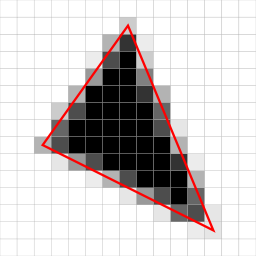

# Rasterization
With Vulkan, everything is in 3D space. However, you may notice that your screen is a 2D panel. A large part of Vulkan's job is transforming the 3D coordinates you give it onto a 2D frame. There are many ways to do this, but the most common method (and the method that Vulkan primarily uses) is called rasterization. This is where Vulkan takes your 3D coordinates, assembles shapes (usually triangles) according to your vertex data, places them onto a 2D grid of pixels (i.e. your screen), colouring the pixels according to your configuration.

The reason this is done on a dedicated graphics card instead of on your CPU in most cases is because instead of having a smaller number of cores with a high clock count, GPUs have a larger number of cores with a lower clock count, making it easier to do lots of small operations in parallel. This is useful for rasterization, which is an algorithm which is highly optimized for running in parallel and, as a result, is capable of rasterizing thousands of frames per second on higher-end graphics cards.